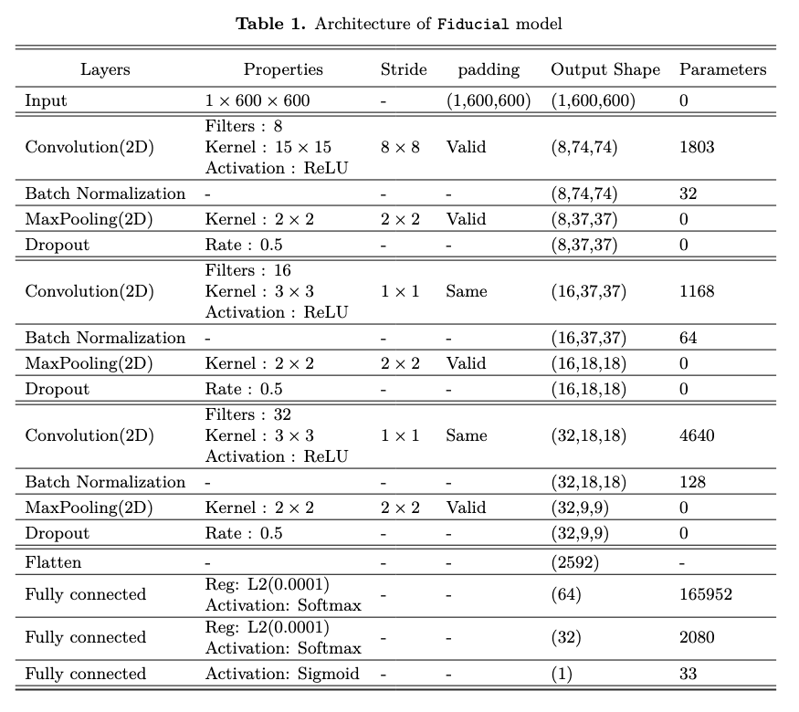
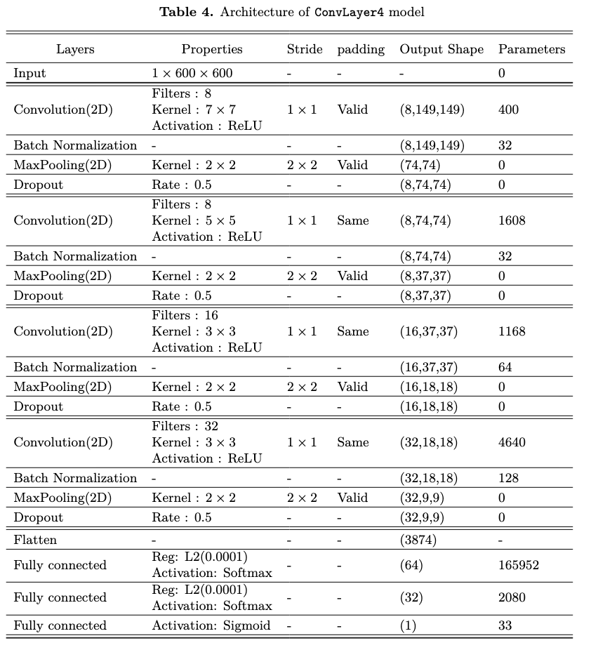
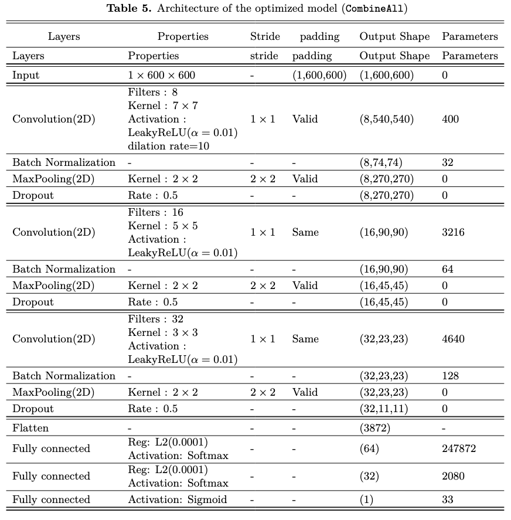

## CNNs Architectures
  >### 1) Fiducial model
  

  
  >### 2) DilationRate10 model
  

  
  >### 3) DilationRate15 model
  

  >### 4) ConvLayer4 model
  

  >### 5) CombineAll model
  

  >### 6) Other models
 Other models (`LReLU`, `AdamBatch64`, `AdamBatch256`, `RAdamBatch64`, `RAdamBatch128`, `RAdamBatch256`, `Adam0.0005`, `Adam0.01`, and `TrainRatio0.4`) are based on the `Fiducial model`, with only minor modifications such as activation function, optimizer, batch size, learning rate or training ratio.

